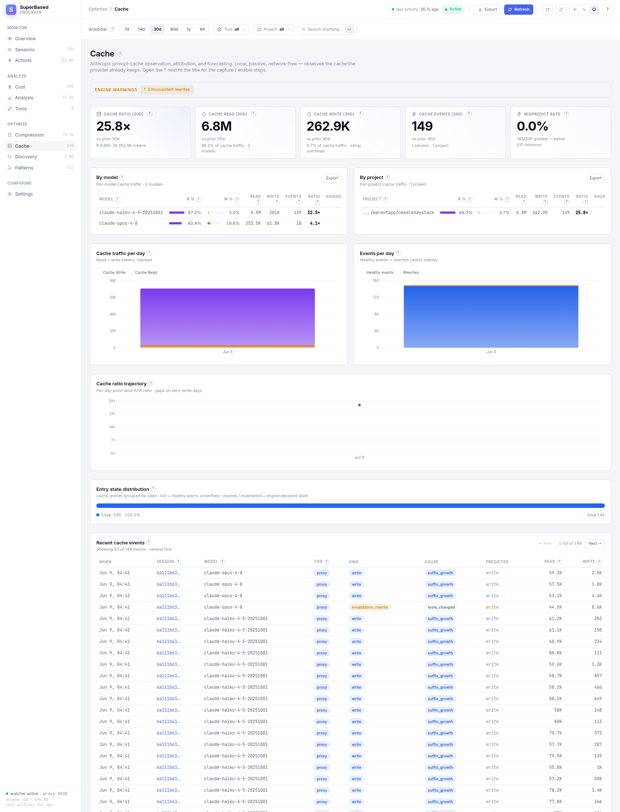
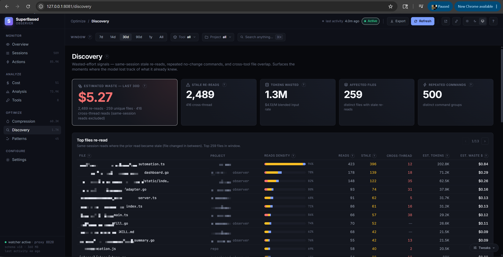

# SuperBased Observer

> One local intelligence layer for every AI coding tool you use.
> Captures sessions, normalizes tokens & costs, and answers the
> question your provider's billing dashboard can't: **what did I
> actually spend it on?**

[](https://www.npmjs.com/package/@superbased/observer)
[](https://www.apache.org/licenses/LICENSE-2.0)
[](#install)
[](https://go.dev/)

<p align="center">
  
</p>

---

## Table of contents

- [What it is in 30 seconds](#what-it-is-in-30-seconds)
- [Install](#install)
- [First-run walkthrough](#first-run-walkthrough)
- [Dashboard tour](#dashboard-tour)
- [MCP server — 17 cross-tool intelligence calls](#mcp-server--17-cross-tool-intelligence-calls)
- [API proxy — accurate token capture + compression](#api-proxy--accurate-token-capture--compression)
- [Architecture](#architecture)
- [Teams & Org Visibility](#teams--org-visibility)
- [Security & control layer (guard)](#security--control-layer-guard)
- [Model routing](#model-routing)
- [CLI reference](#cli-reference)
- [Configuration](#configuration)
- [Post-upgrade hygiene + recovery](#post-upgrade-hygiene--recovery)
- [Build from source](#build-from-source)
- [Contributing](#contributing)
- [License](#license)

---

## What it is in 30 seconds

A single Go binary that sits **passively** alongside Claude Code,
Cursor, Codex, Cline (VS Code) + Cline CLI, GitHub Copilot CLI,
Copilot (VS Code), OpenCode, OpenClaw, Pi, Google Antigravity,
Gemini CLI, Cowork, Nous Research's Hermes Agent, and Kilo Code
(legacy IDE extension + CLI)
— parsing their session logs, optionally proxying their API calls
for accurate token counts, and exposing the result through a local
dashboard, an MCP server (so the tools themselves can query it),
and a CLI.

**Everything stays on your machine.** The watcher, hook handler,
dashboard, MCP server, and CLI never make an outbound network call
on observer's behalf — no telemetry, no analytics, no remote
reporting. The only code paths that touch the network are the optional
API proxy (which forwards **your** requests unchanged to the AI
provider you already use) and a handful of explicit opt-in features
(message-summary LLM, codegraph MCP, Teams org-server). Full details:
[`PRIVACY.md`](PRIVACY.md).

<p align="center">
  
</p>

It answers questions like:

- Where did this week's $147 Claude bill come from — which projects,
  models, sessions, tool calls?
- Did I spend more on Opus or Sonnet? Are my Sonnet sessions hitting
  the long-context tier and getting repriced at 2×?
- How much did I waste re-reading files that hadn't changed since
  the last read in the same session?
- Could that trivial Opus session have been done by Sonnet for 1/5
  the cost?
- Across Claude Code, Cursor, and Codex working in the same repo,
  what files are touched by all three? Where are they stepping on
  each other?

---

## Install

Pick whichever package manager fits your environment — npm and PyPI
ship the same prebuilt binary from the same `v*` tag, version
numbers kept in lock-step.

### Via VS Code (Marketplace or Open VSX)

```bash
code --install-extension superbased.superbased-observer
```

The VS Code extension bundles the observer binary, lifts the
dashboard / sidebar / status bar / file decorations into the editor,
and contributes a terminal profile that pre-exports the proxy env
vars so AI CLIs launched from it route through observer
automatically. Cursor, VSCodium, and Windsurf install the same VSIX
via [Open VSX](https://open-vsx.org).

After install, VS Code's **Get Started** page surfaces an in-editor
walkthrough; the long-form user guide lives at
[`docs/vscode-extension-user-guide.md`](docs/vscode-extension-user-guide.md)
and the command + settings reference is at
[`docs/vscode-extension.md`](docs/vscode-extension.md).

### Via npm (recommended for Node users)

```bash
npm install -g @superbased/observer
observer --version
```

### Via pip / uv / pipx (recommended for Python users)

```bash
pip install superbased-observer            # plain pip
uv tool install superbased-observer        # uv (isolated env, fastest)
pipx install superbased-observer           # pipx (isolated env)
observer --version
```

Wheels ship for `manylinux2014_{x86_64,aarch64}`,
`macosx_*_{x86_64,arm64}`, and `win_amd64`. `uv tool` and `pipx`
keep the install isolated from your project's Python env — generally
what you want for a CLI tool.

### Via go install (latest main, builds locally)

```bash
go install github.com/marmutapp/superbased-observer/cmd/observer@latest
observer --version
```

### Via direct download (pre-built per-platform archive)

Each tagged release attaches per-platform archives to the
[Releases page](https://github.com/marmutapp/superbased-observer/releases),
verifiable against the published `SHA256SUMS`:

| Asset | Platform | Contents |
|---|---|---|
| `observer-vX.Y.Z-linux-x64.tar.gz` | Linux x86_64 | `observer` + `antigravity-bridge.exe` (for WSL2) |
| `observer-vX.Y.Z-linux-arm64.tar.gz` | Linux arm64 | `observer` + `antigravity-bridge.exe` (for WSL2) |
| `observer-vX.Y.Z-darwin-x64.tar.gz` | macOS Intel | `observer` |
| `observer-vX.Y.Z-darwin-arm64.tar.gz` | macOS Apple Silicon | `observer` |
| `observer-vX.Y.Z-win32-x64.zip` | Windows x86_64 | `observer.exe` |
| `SHA256SUMS` | — | sha256 of all five archives |

```bash
# Linux x64 example — substitute your platform + version.
VERSION=v1.6.21
PLAT=linux-x64
curl -L -O https://github.com/marmutapp/superbased-observer/releases/download/$VERSION/observer-$VERSION-$PLAT.tar.gz
curl -L -O https://github.com/marmutapp/superbased-observer/releases/download/$VERSION/SHA256SUMS
shasum -a 256 -c SHA256SUMS --ignore-missing
tar -xzf observer-$VERSION-$PLAT.tar.gz
./observer --version
```

The binary is pure Go — no CGO, no external runtime dependencies.
SQLite storage is pure-Go via `modernc.org/sqlite`. Single static
binary; `scp` it anywhere it runs. Same artifacts ship to npm and to
the Releases page (build-once-ship-everywhere CI), so the npm and
direct-download paths produce byte-identical binaries.

---

## First-run walkthrough

```bash
# 1. Start everything: proxy + watcher + dashboard in one foreground
#    process (ctrl-c to stop). Hooks auto-register for every detected
#    AI tool, and the dashboard opens in your browser
#    (http://localhost:8081; suppress with --no-open).
observer start

# 2. (another shell) Backfill from existing session logs so the
#    dashboard has history immediately rather than starting empty.
observer scan
```

From here the dashboard drives. On an empty database the Overview tab
leads with a three-step onboarding checklist — and a **demo mode**
offer if you'd rather look around first: one click seeds a temporary
synthetic dataset so every chart renders with realistic data (your
real `observer.db` is never read or written; a persistent banner marks
demo state and one click clears it). The two checklist steps that
matter:

3. **Route your AI tool through the proxy** — accurate token counts
   and conversation compression both need it. On the Compression
   tab's **Proxy** banner, click your tool's status pill, then
   **Route through the observer proxy…**: the button previews the
   exact file change (Claude Code: an `env.ANTHROPIC_BASE_URL` entry
   in `~/.claude/settings.json`; Codex: an `observer` model provider
   in `~/.codex/config.toml`) and writes only on confirm. Durable —
   every later session routes automatically. The same section of the
   Settings → Connected tools panel offers a per-tool setup wizard
   (hooks / MCP / routing, one consent click per write) and a Launch
   button. Prefer the terminal? The same routing ships as `observer
   init`, as session-scoped wrappers (`observer claude` / `observer
   codex` — no config writes), or as a plain
   `export ANTHROPIC_BASE_URL=http://localhost:8820` /
   `OPENAI_BASE_URL=http://localhost:8820/v1`.
4. **Use your AI tool as normal.** The checklist tracks the first
   captured session; cost, compression, and cache numbers populate
   within minutes of real activity.

**Optional — MCP registration.** `observer init` additionally writes
MCP server entries (and hook entries) into each AI tool's own config
files (`~/.claude/settings.json`, `~/.claude.json`,
`~/.cursor/mcp.json`, `~/.codex/config.toml`, …). Hooks default ON,
MCP defaults ON; opt out per-side with `--skip-hooks` / `--skip-mcp`.
Idempotent. `observer start` alone never registers the MCP server —
MCP wiring is explicit-only, because it costs ~1,800 schema tokens
per AI-client turn.

**If you route Claude Code while MCP servers are registered, set
`ENABLE_TOOL_SEARCH=true` in the same environment.** Claude Code's
SDK disables `ToolSearch:optimistic` deferred MCP loading whenever
`ANTHROPIC_BASE_URL` is set, eagerly inlining all 17 observer MCP
tool schemas (plus any Google MCPs) into every request prefix —
~+21K tokens/turn. The override re-enables lazy loading; observer's
proxy forwards `tool_reference` blocks byte-identically, satisfying
the SDK's documented safety condition. Empirical: with the override +
v1.7.23 defaults, the proxy is **−6.9% mean cost vs no-proxy** on
Claude Code's reference rig (n=8 lumen refactor task, V7-22 binary).
Without it, ~+9% per-turn overhead. See [the cost-tuning skill](docs/skills/observer-cost-tuning/)
for the full picture.

The proxy logs every turn with the exact token counts the provider
returned, including cache-tier breakdowns (5m vs 1h ephemeral) and
1h surcharges that JSONL adapters can't always disambiguate.

### Verifying the install

```bash
observer doctor          # health checks: DB integrity, hook
                         # registration, MCP entries, pid bridge
observer status          # row counts + recent activity
observer tail            # live-stream captured actions
```

---

## Dashboard tour

`observer start` opens the dashboard automatically on interactive
launches (suppress with `--no-open`; default URL
<http://localhost:8081>). Fifteen tabs in four nav groups (Monitor /
Analyze / Optimize / Configure), each designed around one question —
the tour below covers the core surfaces; Live (recent sessions with a
real-time action feed), Search (full-text over captured tool
outputs), and Privacy (capture map + scrub tester) are
self-explanatory once you're in, and the Suggestions tab's advisor
nudges and the Patterns tab's derived habits are covered in their own
docs. Evaluating without data? Start **demo mode** from the empty
Overview — synthetic dataset in a temp DB, real `observer.db`
untouched, one click to clear.

### Overview — what's been happening?

<p align="center">
  
</p>

Four headline KPI tiles (sessions, API turns, token rows, stale
re-reads — each filterable by the global Window / Tool / Project
chips), cost-over-time stacked area split by billable token bucket,
actions-over-time stacked by tool, top models by token volume, top
tools by action count.

### Sessions — what did each run actually do?

<p align="center">
  
</p>

One row per session with cost, token totals (input / cache R /
cache W / output), elapsed time, action count, and a model badge.
Quality / Errors / Redundancy scoring columns light up once
`observer score` has run. Click a row to open the per-session
slide-over (shown below in [Session detail](#session-detail--drill-into-one-session)).

### Actions — the firehose, filtered

<p align="center">
  
</p>

Every recorded tool call, normalized across adapters. Filter by
action type (28 categories), tool, effort, permission. Each row
exposes its `target` + status + raw-tool source + truncated content
preview; click to expand to the full event with error context.

### Cost — per-model breakdown with the right math

<p align="center">
  
</p>

Eight KPI tiles across the billable token buckets (Net Input, Cache
Read, Cache Write 5m, Cache Write 1h, Output, Reasoning, plus total
USD and turn count). Per-model table shows the full breakdown
including reasoning tokens (billed at output rate) and long-context
surcharges (Sonnet 1M, gpt-5 >272K, Gemini 2.5 Pro >200K). Hover
any column header for its definition + formula.

### Analysis — spending insights & efficiency signals

<p align="center">
  
</p>

Twelve KPI tiles comparing this period to prior: spend Δ%, MTD vs
budget with projection bar, $/M output rate, cache savings + cache
efficacy %, high-context turn count, $/turn, burn rate ($/active
hour), top model concentration %, Discovery waste $, sessions
total. Daily-spend stacked bars with Model / Project / Tool
dimension toggle, hour-of-day heatmap, period-over-period movers
(top increases / decreases / new entrants), and routing-efficiency
suggestions (trivial Opus sessions that could have used Sonnet).

### Tools — per-AI-client breakdown

<p align="center">
  
</p>

Four KPIs (total actions, distinct tools, overall success rate,
busiest tool), activity-over-time stacked area, and per-tool
action-type-mix horizontal bars (100% normalized, colored by action
category). Surfaces which AI client owned which kind of work.

### Compression — what the proxy saved

<p align="center">
  
</p>

Five KPIs: total $ saved (priced at your input rate), tokens saved,
bytes trimmed, turns compressed. Savings-per-day stacked bar by
mechanism (drop, trim, summary), savings-by-mechanism donut, recent
events table with original→compressed→saved + dollar impact per
event.

### Cache — prompt-cache observation & forecasting

<p align="center">
  
</p>

Headline cache-ratio hero (cache_read ÷ cache_write tokens) and three
sibling KPIs: Cache read, Cache write, and Avoidable spend / Event
count. Avoidable spend renders in warn tone — it's the dollar overhead
of rewrites that wouldn't have happened on a perfectly cache-friendly
session. By-model and By-project tables with R%/W% mix bars + absolute
Read/Write/Events + cache Ratio + Avoidable $. Proportional Top
causes histogram (suffix_growth + hit dominate a healthy session;
real invalidations render in warn tone; tools_changed on MCP toggles
renders neutral). Worst sessions table sorted by rewrite count;
click-through opens the per-turn Cache panel.

**How it's captured.** Two paths feed the same engine, both writing
to NODE-LOCAL `cache_segments` / `cache_entries` / `cache_events`
tables (migrations 036+037, never pushed to a Teams org server):

- **Tier-1 (proxy)** — point your AI client at `127.0.0.1:8820` and
  the cachetrack engine reads each turn's `cache_read_input_tokens` +
  `cache_creation_input_tokens` envelope live. Default capture path
  for Claude Code.
- **Tier-2 (transcript watcher)** — feeds the same engine from
  on-disk claude-code JSONL transcripts for sessions that didn't
  route through the proxy. Run `observer backfill --cache-rescan`
  to retrofit history.

**Enable / disable.** Default-on per spec §11 (the loader merges
`[cachetrack].enabled = true` if the section is absent). To turn off:
`[cachetrack].enabled = false` in `~/.observer/config.toml`, then
restart `observer start`. Inspect engine health with
`observer cache-health --json`. Operator reference:
[`docs/cache-tracking.md`](docs/cache-tracking.md).

### Suggestions — the advisor's quantified nudges

Default-on, fully local suggestions engine (zero LLM cost, zero
network): 20 detectors turn the window's captured activity into
ranked, dollar- or minute-quantified recommendations — session
balloons, idle re-cache, long-context tier crossings, trivial
sessions on expensive models, cache hit-rate / cache-write waste /
prefix thrash, read-heavy expensive-model sessions, effort
overprovisioning, fast-tier premium, unrecovered failures, quality
regressions, MCP schema overhead, compression off, capture without
proxy routing, cross-session stale reads, web-search spend, spend
spikes, plus two posture nudges (guard observing idle, routing
evidence ready — each pointing at the surface that owns the
workflow). Every
card carries its arithmetic ("show math"), a confidence score,
snooze/dismiss with a 7-day cooldown, and — where a dashboard
control can fix the finding — a one-click action that navigates to
the right surface (writes stay behind that surface's own consent
flow). CLI twin: `observer advise`. Config: Settings → Advisor
(`[advisor]` — evidence window, confidence/savings floors, opt-in
≤400-token session-start digest).

### Discovery — the waste detector

<p align="center">
  
</p>

Waste $ hero (stale-read tokens × your blended input rate). Four
KPIs: stale re-reads count, tokens wasted, affected files, repeated
commands. Top files re-read table with cross-thread highlighting
(when the same file was re-read from a subagent that didn't see the
parent's read). Repeated-commands table with no-change-rerun
detection.

### Security — the guard, operable end to end

Posture tiles + a filterable verdict timeline (rule IDs resolve to
their full definitions), then the routine workflows: a consent-gated
mode control that shows the simulate evidence before you flip
enforce, the enforce-readiness replay over your real history, the
approvals register (scoped, expiring — live immediately), a
lint-gated user-policy editor with `.bak` undo, budget guardrails
suggested from your own observed spend with a daily burn-down meter,
MCP pin approvals, and one-click compliance evidence downloads.

### Routing — decisions, savings, and the adoption ladder

Preview what a policy would have saved while routing is still off (a
read-only replay of your recorded turns), then: the decisions feed
with per-decision drill-down (matched rule, reason codes, cache
economics), savings with CI95 error bars, the expanded rule table
(demoted rules marked), tier map + calibration overlays, the
advise-shadow readiness ladder with its consent-gated promote
control, a lint-gated `[[routing.rules]]` editor (Settings →
Routing), and the Apply-to-tools card — observed sub-agent evidence
written into per-tool native config with per-file consent, backups,
revert, and an audit ledger.

### Settings — every config knob, editable

<p align="center">
  
</p>

Schema-driven forms for every config section — Watcher, Freshness,
Retention, Hooks, Proxy, Compression, Intelligence, Advisor, Cache
tracking, Secrets scrubbing, MCP, Profiles, Org share, OTel — with
honest reload semantics per section: pricing and profile changes
apply hot, MCP applies to the next AI session, restart-gated
sections raise a persistent restart-pending banner that names the
exact command and clears only when the daemon actually restarts.
Alongside the forms: a **Connected tools** panel (per-tool status
matrix, consent-gated setup wizard, Launch button), a **Health**
panel (the `observer doctor` checks + recent failures), the
**Backfill** panel (every mode click-to-run with streamed output +
full rescan), a **Storage** panel (per-table DB size breakdown with
index/FTS bytes folded in, vacuum + online backup as click-to-run
jobs, documented manual restore — CLI twin `observer db
stats|vacuum|backup`), and a config-file card with one-click `.bak`
restore.
156 baked-in default models; pricing "Override" prompts auto-fill
from the default.

### Session detail — drill into one session

<p align="center">
  
</p>

Click any session row → slide-over with action-type breakdown
donut, token-bucket bar (input / cache R / cache W / output),
per-message timeline showing every upstream API turn with model,
tokens, cost, and the tool calls inside it. Same panel surfaces
from Actions when clicking a session pill.

---

## MCP server — 17 cross-tool intelligence calls

**Opt-in.** The MCP server is not active until you run
`observer init` (or `observer init --claude-code` / `--cursor` /
`--codex`). That command writes entries pointing at the observer
binary into each AI tool's own MCP config file
(`~/.claude.json`, `~/.cursor/mcp.json`, `~/.codex/config.toml`).
The MCP server then runs as a **stdio subprocess spawned by your AI
tool** — its lifecycle matches the AI tool's, and it never opens a
network port. `observer start` alone does NOT register or launch
the MCP server; it can be skipped entirely via
`observer init --skip-mcp` if you want hooks-only capture.

Once registered, every connected AI tool can query the observer
over MCP/stdio:

| MCP tool | What it answers |
|---|---|
| `check_file_freshness` | Has this file changed since I last read it? |
| `check_command_freshness` | Did this exact command already run? With what result? |
| `get_file` | The file's current bytes (or at a given commit), with path-safety gate + audit. |
| `get_file_history` | Every read/edit of this file across every tool + session (with codegraph enrichment when available). |
| `get_session_summary` | What did session X actually do? AI-generated 2–4 sentence summaries. |
| `get_session_recovery_context` | For resuming an interrupted session. |
| `get_project_patterns` | Derived behaviours: hot files, co-changes, edit→test pairs. |
| `get_last_test_result` | Without re-running. |
| `get_failure_context` | Error correlation + retry detection. |
| `get_action_details` | The raw row, scrubbed of secrets. |
| `get_cost_summary` | Per-window spend rollup. |
| `get_redundancy_report` | What would Discovery flag for this project? |
| `get_relations` | Codegraph BFS — who calls / is called by this symbol. |
| `get_symbols` | Resolve symbol name + range to file path + body (codegraph-backed). |
| `list_actions_around` | Chronological ±N actions around an `action_id`. |
| `search_past_outputs` | Full-text search of past tool-call outputs (FTS5 over excerpts). |
| `retrieve_stashed` _(conditional)_ | Pulls original bytes of a tool_result the proxy stashed (only registered when CCR is enabled). |

**Operator note for Claude Code via observer's proxy.** When you set
`ANTHROPIC_BASE_URL=http://localhost:8820`, Claude Code's SDK
disables `ToolSearch:optimistic` deferred MCP loading — observer's
17 tool schemas (plus any Google MCPs you've registered) end up
eagerly inlined into every request prefix, ~+21K tokens/turn. **Set
`ENABLE_TOOL_SEARCH=true` in the same shell** to recover lazy
loading; observer's proxy forwards `tool_reference` blocks
byte-identically, satisfying the SDK's documented safety condition
for the override. See [the cost-tuning skill](docs/skills/observer-cost-tuning/)
for the full picture.

Knowledge captured from one tool benefits all the others working on
the same project — data is organized by git root, not by tool. A
read by Claude Code becomes a freshness signal for Codex; a Cursor
compaction is visible from Cline.

---

## API proxy — accurate tokens, compression, stash

The proxy is the home of three features that only exist when your AI
client routes through it. None of them run on the watcher / `observer
start` ingestion path — compression and stash live in the request
path because that's the only place where bytes can be rewritten
before they reach the upstream provider.

When you point your AI tool at `http://localhost:8820`, the proxy:

1. **Forwards your request to your chosen upstream** (Anthropic or
   OpenAI). The destination is the same provider URL your AI client
   would have called directly; no data leaves your machine that
   wasn't already going to that provider. Your API key is yours —
   the proxy reads it from the inflight headers, never stores it.
2. **Records the exact token counts** the provider returned (cache
   5m vs 1h split, long-context tier triggers, reasoning tokens)
   into the `api_turns` table — more accurate than parsing the
   JSONL the AI tool wrote.
3. **Compresses the conversation** before forwarding
   (importance-scored, prefix-stable for cache alignment) — the
   biggest lever for keeping long sessions inside rate-limit
   windows. **Opt-in**: flip `[compression.conversation].enabled =
   true` (or the Settings → Compression toggle); once enabled, tuned
   per-tool profiles apply automatically (see below), with the safe
   per-type set (`compress_types = ["json","logs","code"]`) on
   Anthropic traffic. Compressed events land in the
   `compression_events` table and surface on the Compression
   dashboard tab. Empirical on Claude Code lumen rig (n=8, V7-22):
   **−6.9% mean cost vs no-proxy**, CV 7.6%, zero tail outliers.
4. **Stashes large tool outputs** the compressor hides, so the
   originals stay retrievable via the `retrieve_stashed` MCP tool
   (only registered when stash is configured). **Off by default —
   stash markers break Anthropic's prefix cache** (V7-25 n=1
   measurement: +25% cost, `cache_creation_input_tokens` doubled).
   Operators who want stash on a workload should A/B before
   committing.

Three compression layers, each independently toggleable:

- **Shell output filters** — RTK-style truncation of large `bash` /
  `git` / `go test` / `docker` / `kubectl` / `cargo` / `pytest`
  outputs inline before they hit the LLM context. Runs on hook /
  `observer run` paths; does not require the proxy.
- **Tool output indexing** — every tool call's output indexed into
  FTS5; large outputs trimmed to a 2KB excerpt cap so the index
  stays compact and `search_past_outputs` stays fast. Runs on the
  watcher path; does not require the proxy.
- **Conversation compression** — proxy rewrites large `tool_result`
  blocks before forwarding upstream. **Proxy-only** — there is no
  non-proxy path for this layer, and the stash that backs
  `retrieve_stashed` is wired here too.

**Trade-off if you skip the proxy:** you still get full hook + JSONL
ingestion, the dashboard, MCP (if registered), and shell+indexing
compression. You lose proxy-grade token accuracy, conversation
compression, and the stash. For rate-limited plans (Claude Teams 5h/7d
windows), conversation compression is usually the difference between
"finishes the task" and "hits the limit."

### Choosing a compression mode (Anthropic vs Codex)

`mode` is a profile parameter — each shipped profile (next section)
already pins the right one, so most users never set it by hand; the
matrix below is the why. It behaves differently per provider. Per-type
`tool_result` compression runs in every mode; `mode` only changes how messages
are dropped and whether an Anthropic `cache_control` marker is injected.

| `mode` | What it does | Claude Code (Anthropic) | Codex / OpenAI |
|---|---|---|---|
| `token` | Per-type compress, then drop lowest-scored messages to hit `target_ratio`. | ✅ Works. | ✅ Clearest choice for Codex/OpenAI. |
| `cache` | Restrict drops to the tail half + inject a `cache_control` marker at the prefix boundary. | ✅ Anthropic-specific. | ⚠️ No effect beyond `token`. |
| `cache_aware` *(default)* | Skip drops, narrow compression to `tool_result` blocks, no marker injection; keep history byte-stable across turns so Anthropic's prefix cache keeps hitting (`cache_creation` falls on later turns). | ✅ **Recommended for Anthropic Pro/Max** — and the shipped default. | ⚠️ No effect beyond `token`, so the default is harmless for Codex. |

The shipped default is `cache_aware` (`token` is just the internal fallback when
`mode` is empty). The `cache`/`cache_aware` strategies exist for **Anthropic's
content-hash prefix cache** (`cache_control` is an Anthropic Messages API
concept). OpenAI/Codex prompt caching is **automatic and server-side** — there
is nothing to mark or tune, so the proxy's OpenAI path is mode-agnostic (the
default `cache_aware` simply behaves like `token` there).

### Profiles — the right parameters per tool, automatically

Compression parameters ship as **profiles**: named parameter sets
resolved per traffic class at the proxy boundary (formerly "recipes",
which had to be hand-picked per daemon — and applied to *all* traffic,
mis-tuning whichever tool the recipe wasn't written for). Enable
compression once and the tuned parameters apply per tool
simultaneously:

| Profile | Auto-assigned to | Headline params | Measured |
|---|---|---|---|
| **`claude-code`** | Anthropic-path traffic (`claude-sonnet-4-6`, `claude-opus-4-8`, any `claude-*` via Claude Code) | `cache_aware`, ratio 0.85, json+logs+code+tools, stash off (V7-25: stash breaks Anthropic's prefix cache) | **−6.9% mean cost vs OFF** (n=8 lumen refactor, CV 7.6%, zero tail outliers; requires `ENABLE_TOOL_SEARCH=true` when MCP servers are registered). The A2 run (2026-06-11, n=8 Opus 4.8) added the tools-defs trim: **−12.5%** vs the pre-A2 set with zero `tools_changed` cache events. |
| **`codex-safe`** | OpenAI-path traffic (plain GPT under the codex CLI: `gpt-5.4`, `gpt-5.5`, any non-`-codex`) | `token` mode, ratio 0.95, logs-only (JSON sentinel substitution corrupts codex tool data) | −22% to −56% on gpt-5.4-mini (V7-21, n=10); **inconclusive** on an `apply_patch`-only workload (V7-26 — no logs-shaped output, so the proxy was a no-op; A/B your own traffic shape) |
| **`codex-variant`** | manual — `observer profile assign openai codex-variant` | ratio 0.99, preserve 50, **no per-type compression** (V7-2: `-codex` models re-derive when tool_results change) | **−10%** ($0.270 vs $0.300, n=10, gpt-5.3-codex) |
| **`default`** | escape hatch | master-config `[compression.conversation]` params, unchanged | — |

"variant" in `codex-variant` means the `-codex` *model variant*
(`gpt-5.3-codex`, anything `*-codex*`), not a variant of the codex
CLI — both codex profiles are for the codex CLI.

Working with profiles:

- **Inspect**: `observer profile list` (assignments + sources),
  `observer profile show codex-safe` (the resolved TOML).
- **Reassign** per traffic class or per tool: `observer profile
  assign openai codex-variant`, `observer profile assign tool:cline
  codex-safe` — or Settings → Profiles in the dashboard.
- **Custom profiles**: `observer profile create mine --from
  claude-code`, then `observer profile set mine
  compression.conversation.target_ratio 0.9` — or the Settings →
  Profiles editor.
- **Per-project overrides**: a repo-level `.observer/config.toml`
  (`[profiles]` + `[compression]` keys only) picks different profiles
  or turns compression OFF for that repo's traffic — never on
  (untrusted-repo guard).
- **Hot for new sessions**: profile edits and assignment changes
  apply without a daemon restart. The master `enabled` switch itself
  is restart-gated — the dashboard banner says so honestly.
- `observer start --recipe <name>` survives as a deprecated alias
  that pins one profile for all traffic.

Full data behind the numbers:
[`docs/v1.7.23-compression-savings-empirical-2026-06-01.md`](docs/v1.7.23-compression-savings-empirical-2026-06-01.md).
Full knob reference (stash, rolling-summary's per-provider model
split, compaction):
[`docs/compression-modes.md`](docs/compression-modes.md). Then route
your client through the proxy — the one-click button path in the
[First-run walkthrough](#first-run-walkthrough) — and restart it.

---

## Architecture

```
┌──────────────┐     ┌──────────────┐     ┌──────────────┐
│  Claude Code │     │    Cursor    │     │    Codex     │   ... 17 tools / 15 adapters
└──────┬───────┘     └──────┬───────┘     └──────┬───────┘
       │ JSONL              │ hook events       │ rollout files
       ▼                    ▼                    ▼
┌────────────────────────────────────────────────────────┐
│              fsnotify Watcher + Adapters                │
│       (one parser per platform, normalized output)      │
└────────────────────────┬───────────────────────────────┘
                         │ ToolEvent / Action / Session
                         ▼
┌────────────────────────────────────────────────────────┐
│   SQLite (WAL, pure-Go via modernc.org/sqlite)          │
│   actions · sessions · projects · file_state ·          │
│   api_turns · token_usage · failure_context ·           │
│   compaction_events · action_excerpts (FTS5)            │
└────────────────────────┬───────────────────────────────┘
                         │
        ┌────────────────┼────────────────────────┐
        ▼                ▼                        ▼
┌──────────────┐  ┌──────────────┐       ┌──────────────┐
│   Dashboard   │  │  MCP Server  │       │   API Proxy  │
│  HTTP+/api/*  │  │ stdio · 13   │       │  Anthropic + │
│  12 tabs      │  │  tools       │       │  OpenAI      │
└──────────────┘  └──────────────┘       └──────────────┘
                                                 │
                                                 ▼
                                          upstream API
                                          (traffic passes
                                           through verbatim,
                                           with token tracking
                                           + optional compression)
```

Adapters parse each platform's session format into a unified
`Action` row. The cost engine reads `api_turns` (proxy, accurate)
and `token_usage` (JSONL adapters, approximate) and deduplicates
per-turn via the upstream `request_id` ↔ `source_event_id` match.
The MCP server exposes the same database. The dashboard pulls JSON
from the same `/api/*` endpoints the MCP tools use.

---

## Teams & Org Visibility

For teams, an optional **`observer-org`** server gives admins org-wide
visibility — per-developer and per-team spend, project rollups, and budgets —
without changing the solo-local experience at all. It is purely additive: a
developer who never enrols sees a byte-identical local tool. Developers opt in
with `observer enroll --link <magic-link>`, after which the agent pushes
**hash/metadata-only** rollup rows (signed, gzipped, deduplicated) to the
server. The default v1.8.0+ posture ships sha256 hashes of command targets,
filesystem paths, and git remotes — never the raw values; a per-node opt-in
(`[org_client.share].full_content = true`) lets a developer choose to share
full content, but the org admin **cannot flip this remotely**.

Authentication is SAML SSO for humans, SCIM 2.0 for provisioning, and Ed25519
bearers for agents; no prompts, command bodies, full assistant responses, or
file contents ever leave the machine — even in the opt-in full-content mode,
only the small set of fields the agent already stores in metadata-only mode
gets expanded. The server ships as a signed Docker image
(`ghcr.io/marmutapp/observer-org`) and a Helm chart (`charts/observer-org/`).

Local-in-5-minutes: `observer-org quickstart` brings up a dev compose stack,
provisions an admin, mints an enrolment token, and prints a ready-to-share
magic link. `observer org status` / `preview` / `backfill` give the developer
full visibility into what their agent is shipping.

Independently, each agent can export per-turn LLM spans to your own
OpenTelemetry collector (`gen_ai.*` + `sbo.*` attributes, off by default).

- **[Getting started](docs/teams-getting-started.md)** — `observer-org
  quickstart` for local-in-5-minutes; production SAML/SCIM bring-up.
- **[Architecture](docs/teams-architecture.md)** — components, runtime data
  flow, the v1.8.0 privacy posture, source map.
- **[Operations](docs/teams-operations.md)** — backup/restore, key rotation,
  upgrades, troubleshooting, `scrub-content` for legacy DBs.
- **[Local test plan](docs/plans/teams-local-test-plan.md)** — 7-phase evaluator
  plan an external reviewer can run from a fresh clone in ~15 minutes.

---

## Security & control layer (guard)

The guard evaluates every captured agent action against a table-driven policy
— built-in rules (destructive commands, project boundaries, secrets egress,
MCP pinning, taint/dataflow, budgets) plus your own TOML rules — records each
verdict in a hash-chained tamper-evident audit table, and blocks
pre-execution on the channels that support it (Claude Code and Cursor hooks,
the proxy egress path, plus native permission rules it compiles into each
client's own config). It ships **observe-only by default**: nothing blocks
until you flip enforce, and `observer guard simulate --since 168h` replays
your real history against current policy first so you know exactly what
enforce would have done.

Teams installs can distribute an Ed25519-signed org policy bundle that merges
as a strictness floor (escalate-only — the server can never weaken node
policy), with fleet rollups and RBAC on the org dashboard. Audit rows export
as JSONL/CEF for SIEM ingestion, and `observer guard report` renders a
compliance evidence pack mapped to SOC 2 / NIST 800-53. The no-network
invariant holds: nothing leaves the machine unless you opt into Teams push,
the OTel feed, or the cloud alerting tier individually.

Every routine guard workflow also runs from the dashboard's Security page
(mode control with simulate evidence, enforce-readiness replay, approvals,
lint-gated policy editor, budget guardrails, evidence downloads) — see the
[Dashboard tour](#dashboard-tour) above.

- **[Operator guide](docs/guard.md)** — concepts, modes, coverage matrix,
  config reference, the honest "what guard does NOT do" list.
- **[Enforce runbook](docs/guard-enforce-runbook.md)** — the observe→enforce
  migration: simulate → review → per-rule ramp → enable → monitor → rollback.
- **[Rule catalog](docs/guard-rules.md)** — every built-in rule ID (generated).
- **[Policy authoring](docs/guard-policy-authoring.md)** — the TOML matcher
  vocabulary with a worked 7-recipe cookbook.
- **[Compliance mapping](docs/guard-compliance.md)** — SOC 2 CC-series +
  NIST 800-53 AU-2/AU-3/AU-9/AC-6, and the evidence-pack commands.

---

## Model routing

Selects the right model for each kind of work — from your own observed
evidence — through two channels: **A** writes each AI tool's own config
(claude-code per-subagent `model:` frontmatter; dry-run first, backed up,
revertable, audit-ledgered; other tools get exact paste-able snippets) and
**B** rewrites the `model` field on requests transiting the proxy. Opt-in,
advise-first, fail-open everywhere: a routing failure can never break a turn
that would have succeeded.

The adoption ladder is deliberate and every step has a dashboard surface:
preview the value while routing is still off (read-only replay of recorded
turns) → advise (decisions recorded, requests untouched) → read the shadow
(the readiness ladder: volume, real net savings after cache forfeits, zero
quality flags) → promote to enforce through a consent dialog that restates
the evidence and warns loudly when the gate is not met. Switch economics are
cache-priced (a switch that forfeits a warm prompt cache worth more than it
saves is held), and any rule whose downshifts grade as regressing is
auto-demoted back to advise — loudly, never silently. Decision rows and
calibration stay node-local; org-distributed policy fragments structurally
cannot flip your enforce switch (**no remote enforce toggle exists**).

- **[Operator guide](docs/model-routing.md)** — quick start, the
  first-30-days runbook with the shadow-readiness decision tree, the §R21
  config table, and the 9-recipe `[[routing.rules]]` gallery.
- **[Spec](docs/model-routing-spec.md)** — §R1–R26.

---

## CLI reference

| Command | Purpose |
|---|---|
| `observer init [--all]` | Register hooks + MCP server + durable proxy routes with every detected AI tool (each side defaults on; `--skip-hooks` / `--skip-mcp` / `--skip-proxy-route` opt out). Zero flags on a terminal → an interactive checklist: preview + consent per write, MCP never pre-selected. Any flag keeps batch mode. |
| `observer uninstall [--all] [--purge]` | Reverse of `init`. Refuses to touch drifted configs unless `--force`. `--purge` also deletes `~/.observer/`. |
| `observer scan [--force]` | One-time backfill — parse all known session files into the DB. `--force` re-walks from offset 0. |
| `observer watch` | Live fsnotify-based watcher daemon. |
| `observer start` | Proxy + watcher + dashboard in one foreground process. Auto-opens the dashboard on interactive launches (`--no-open` to skip). |
| `observer claude [-- args…]` | Launch Claude Code routed through the proxy for that session only — no config writes; re-exports a fresh Pro/Max OAuth token so the SDK can't bypass the proxy. `--verify` = pre-flight checks only. See [`docs/proxy-wrappers.md`](docs/proxy-wrappers.md). |
| `observer codex [-- args…]` | Launch Codex routed through the proxy for that session only (argv `openai_base_url` injection, no config writes). |
| `observer profile list\|show\|assign\|create\|delete\|set` | Compression profiles: inspect, reassign per traffic class / per tool, create + edit custom ones. Hot for new sessions. |
| `observer config set <key> <value> [--project <root>]` | Dotted-key config setter through the shared validated write path; `--project` writes the repo-level override file. |
| `observer proxy start` | Run only the API reverse proxy. |
| `observer dashboard [--port N]` | Embedded dashboard + `/api/*` JSON on http://localhost:N (default 8081). |
| `observer cost [--days N] [--group-by …]` | Token + USD rollup from the CLI. |
| `observer discover` | Stale re-reads + redundant-commands report. |
| `observer patterns` | Derive hot files, co-changes, common commands, edit→test pairs. |
| `observer learn` | Derive correction rules from failure→recovery pairs. |
| `observer suggest` | Compose patterns + corrections into CLAUDE.md / AGENTS.md / .cursorrules. |
| `observer summarize` | Generate AI session summaries (uses Anthropic Haiku). |
| `observer score` | Session quality scoring (error rate, redundancy, onboarding cost, retry cost). |
| `observer status` | Row counts + recent activity. |
| `observer tail` | Live-stream captured actions. |
| `observer advise` | Prescriptive cost/quality suggestions (the Suggestions tab, in the CLI). |
| `observer cache-health` | Prompt-cache engine health: grading gate, read:write consistency, cause concentration. |
| `observer doctor` | Health checks: DB integrity, hook checksums, MCP drift, pid bridge, proxy routing gaps. |
| `observer prune` | Run retention now. |
| `observer db stats\|vacuum\|backup` | Storage manager: per-table size breakdown (index + FTS5 shadow bytes folded in), reclaim free pages with bytes-freed report, online snapshot via `VACUUM INTO` (safe while the daemon runs; refuses overwrite). |
| `observer db import <path> [--dry-run]` | Merge another `observer.db` (a stranded install from another OS / home dir) into this node's. Idempotent single-transaction merge; `--dry-run` rolls the same transaction back for exact counts. Migrates the source first — point it at a copy. |
| `observer metrics [--port N]` | Prometheus `/metrics` endpoint. |
| `observer export {json\|csv\|xlsx}` | Dump tables for external analysis. |
| `observer backfill --<mode>` | Re-populate columns added by later migrations. `--all` runs every mode. |
| `observer run <command>` | Run a command with its stdout streamed through the shell filter. |
| `observer hook <tool> <event>` | Hook entrypoint (called by the AI tools after `init`). |
| `observer serve` | MCP stdio server (spawned by AI tools). |
| `observer completion <shell>` | Shell completions (bash / zsh / fish / powershell), e.g. `observer completion zsh > "${fpath[1]}/_observer"`. |

`observer <command> --help` for full flag listings. Bare `observer`
prints a status welcome (daemon up? dashboard URL? next step) instead
of the help wall; `observer --help` keeps the complete list.

---

## Configuration

Default location: `~/.observer/config.toml`. Override with
`--config`. A minimal config:

```toml
[observer]
db_path = "~/.observer/observer.db"
log_level = "info"

[proxy]
enabled = true
port = 8820
anthropic_upstream = "https://api.anthropic.com"
openai_upstream = "https://api.openai.com"

[intelligence]
monthly_budget_usd = 100   # surfaces on Analysis tab; 0 hides

[compression.shell]
enabled = true
exclude_commands = ["curl", "playwright"]

[compression.indexing]
enabled = true
max_excerpt_bytes = 2048

[compression.conversation]
enabled = false            # opt-in; modifies request bodies in flight
mode = "cache_aware"       # "token" | "cache" | "cache_aware" — see "Choosing a compression mode" below
target_ratio = 0.85
preserve_last_n = 5
compress_types = ["json", "logs", "code"]

# Per-model pricing overrides. Only specify what differs from baked-in.
[intelligence.pricing.models."claude-sonnet-4-6"]
input = 3.0
output = 15.0
cache_read = 0.30
cache_creation = 3.75
cache_creation_1h = 6.00

# Long-context tier example (Anthropic Sonnet 1M, gpt-5 >272K,
# Gemini 2.5 Pro >200K). When prompt exceeds the threshold, every
# rate is replaced with its long_context_* counterpart for that turn.
[intelligence.pricing.models."claude-sonnet-4-5"]
input = 3.0
output = 15.0
cache_read = 0.30
cache_creation = 3.75
cache_creation_1h = 6.00
long_context_threshold = 200000
long_context_input = 6.0
long_context_output = 22.50
long_context_cache_read = 0.60
long_context_cache_creation = 7.50
long_context_cache_creation_1h = 12.00
```

Every key has a TOML environment-variable override:
`OBSERVER_<SECTION>_<KEY>` (uppercased, underscores). Nested
sections join with extra underscores:
`OBSERVER_COMPRESSION_CONVERSATION_ENABLED=true`.

The Settings tab in the dashboard provides a fully-editable visual
editor for everything in `config.toml` — pricing and profile changes
apply hot, MCP settings apply to the next AI session, and
restart-gated sections raise a persistent banner that names the
exact restart command and clears itself once the daemon actually
restarts (the daemon never restarts itself).

---

## Post-upgrade hygiene + recovery

After upgrading the binary, or whenever the Actions tab looks
gappy (watcher fell behind, daemon restart with stale state,
fsnotify event drops):

```bash
observer backfill --all
```

Re-walks every JSONL the adapters know about from offset 0, then
runs the surgical column-update backfills (cache-tier, message-id,
etc.) on top. The `(source_file, source_event_id)` UNIQUE index
keeps the pass idempotent.

The dashboard surfaces a top-of-page banner whenever the watcher's
parse cursor for any session file is more than 10 KB behind the
on-disk size, so silent data loss has a visible signal.
`observer backfill --help` lists every supported flag.

---

## Build from source

```bash
git clone https://github.com/marmutapp/superbased-observer
cd superbased-observer
make build        # builds bin/observer + bin/antigravity-bridge.exe
make test         # full test suite (race detector enabled)
make all          # fmt + vet + lint + test + build
```

Requirements: **Go 1.22+**. No CGO. SQLite via `modernc.org/sqlite`
(pure Go). golangci-lint optional for `make lint`. Dashboard
source under `web/` (React + TypeScript + Vite + Tailwind); the
compiled bundle is committed to
`internal/intelligence/dashboard/webapp/dist/` so a contributor
who only touches Go can `make build` without Node.

If you edit `web/src/`:

```bash
# Hot-reload dev loop (Vite serves :5173, proxies /api/* to observer)
./bin/observer dashboard --addr 127.0.0.1:8081 &
cd web && npm install && npm run dev

# When done, rebuild the embedded bundle and commit
make web-build
git add internal/intelligence/dashboard/webapp/dist web/dist
```

`make web-build` regenerates both `web/dist` and the embedded copy.
Requires **Node 22 LTS**.

### CI gates

Every PR + push to `main` runs `.github/workflows/ci.yml`:

- **`frontend`** — `npm ci` → typecheck → build → dist-consistency
  check (asserts the committed embedded bundle matches a fresh build).
- **`go`** — `go vet` → `go test -race` → cross-compile.

Tag pushes (`v*`) trigger `.github/workflows/npm-release.yml`:
builds the frontend once, cross-compiles five platform binaries,
ships them to npm, and creates a GitHub Release.

---

## Contributing

PRs welcome. Table-driven tests in every package; >80% coverage on
core packages (cost, freshness, adapters, store). Run `make test`
before submitting; `make all` locally to catch fmt/vet/lint issues.
Conventional commits (`feat:` / `fix:` / `chore:` / `docs:` /
`test:` / `refactor:` / `perf:`).

For larger changes, open an issue first to align on scope. Adapter
contributions (a new AI coding tool to support) are particularly
welcome — see existing adapters in `internal/adapter/` for the
pattern.

---

## License

Apache 2.0 — see [`LICENSE`](LICENSE).
